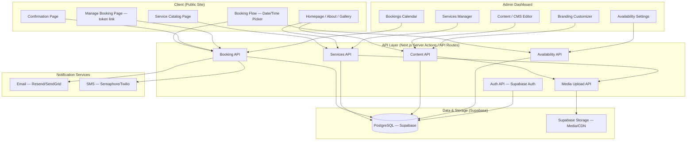
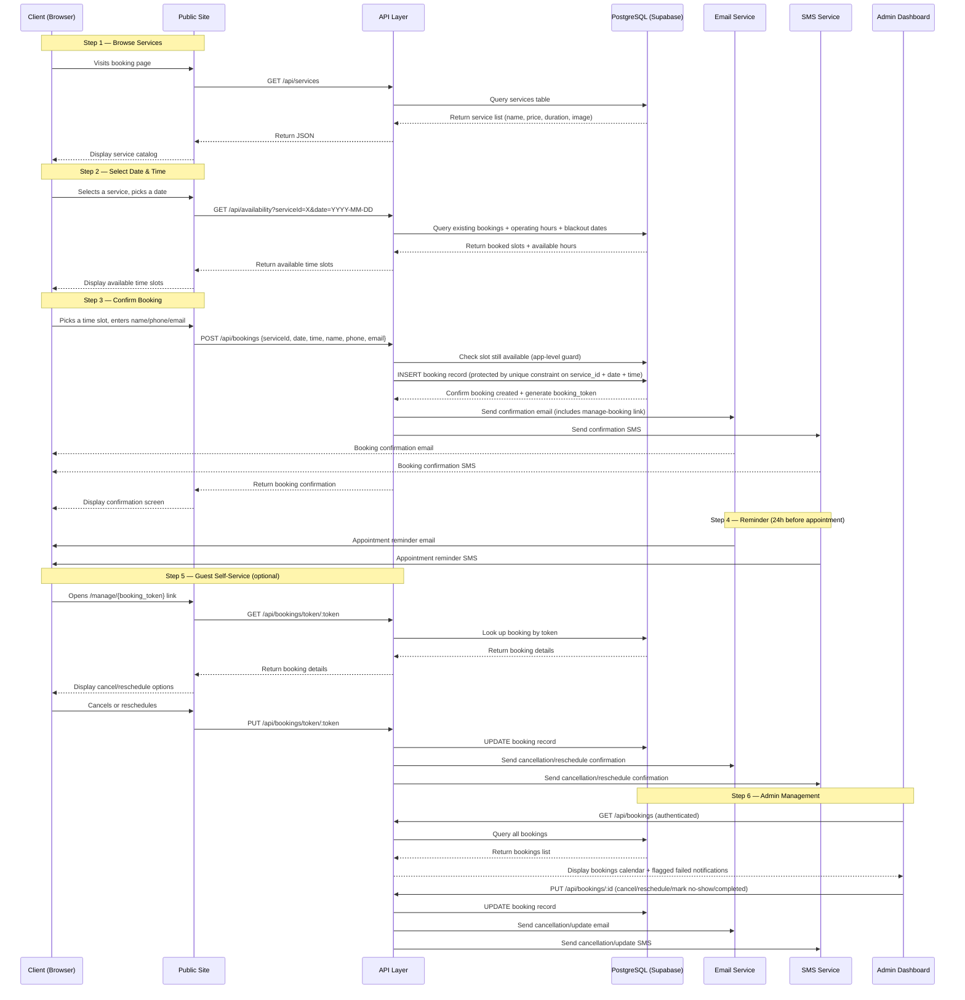
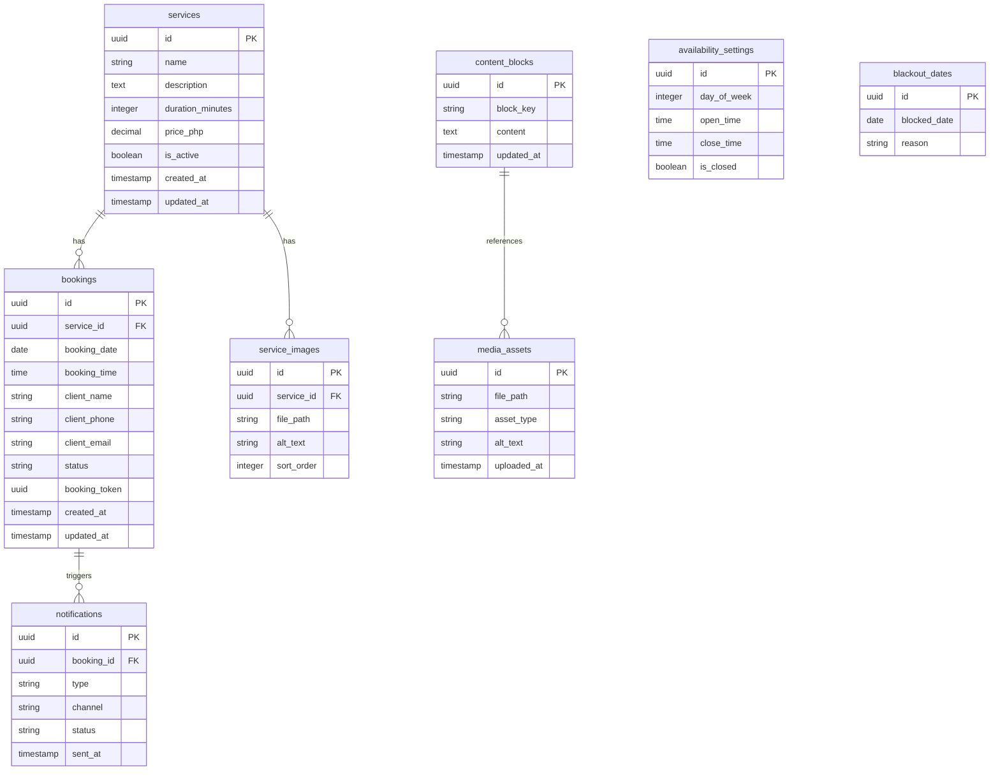

# Jenca Aesthetics
## Online Booking System — Proposal & Technical Roadmap

A simple, aesthetic web application for online appointment booking, content management, and automated client reminders — built for a startup skincare clinic in the Philippines.

---

## 1. Problem & Opportunity

- **Manual booking is slow and error-prone** — clients call or message on social media, staff manually write appointments down, double-bookings happen.
- **No online presence for booking** — competitors offer online booking; Jenca Aesthetics currently has no way for clients to self-serve appointments.
- **No-shows hurt revenue** — without reminders or confirmations, clients forget appointments.
- **Content updates require a developer** — every text or image change on the site means paying someone to make edits.
- **Opportunity:** A lightweight booking site with self-service scheduling, automated reminders, and an admin-managed mini-CMS gives Jenca Aesthetics a professional online presence from day one — without ongoing developer costs for routine updates.

---

## 2. Proposed Solution Overview

- **Public booking website** — clients browse treatments, pick a date/time, and confirm their appointment in under a minute. No account needed.
- **Admin dashboard** — clinic owner manages services, pricing, availability, bookings, and all website content (images, text, branding) from one place.
- **Automated notifications** — clients receive instant email + SMS confirmation upon booking, and a reminder before their appointment.
- **Mini-CMS** — admin can upload/replace photos, edit homepage/about/promo text, and update logo/brand colors without touching code.
- **Simple, fast, mobile-first** — designed for clients booking on their phones, optimized for the Philippine market (PHP, local SMS).

---

## 3. Feature Scope — Phase 1 (Launch)

### 3.1 Service Catalog
- Admin-managed list of treatments/services
- Each service includes: name, description, duration, price (PHP), and image
- Public visitors browse services before booking

### 3.2 Online Booking (Guest, No Account)
- Client selects a service → picks an available date → picks an available time slot
- Client enters name, phone, email to confirm
- System checks availability in real-time to prevent double-booking
- Booking confirmation screen + instant email/SMS receipt
- Basic bot/spam protection on the public booking form (honeypot field and/or lightweight CAPTCHA such as Cloudflare Turnstile) plus rate-limiting per IP/phone number, since the form is open to anyone without an account

### 3.2.1 Guest Self-Service Cancel/Reschedule
Since clients book without creating an account, cancellation and rescheduling are handled via a secure, single-use link rather than a login.

- On booking creation, the system generates a unique, non-guessable `booking_token` (UUID) tied to that booking.
- The confirmation email/SMS includes a "Manage my booking" link: `https://[domain]/manage/{booking_token}`.
- That page lets the client view their appointment details and:
  - **Cancel** — subject to the clinic's cancellation policy (e.g., no cancellation within X hours of appointment, displayed on the page).
  - **Reschedule** — reuses the same availability engine as new bookings; cancels the original slot and creates a new one on confirmation.
- The token expires automatically once the appointment has passed or been cancelled, and is never re-usable afterward.
- No sensitive data beyond the booking itself is exposed via the link — no access to other bookings, no admin functions.
- Requests to `/manage/{token}` are rate-limited to prevent brute-force token guessing.

This keeps the "no account needed" promise from Section 3.2 while giving clients real self-service control, and reduces the volume of manual cancellation requests to admin.

### 3.3 Automated Notifications
- **Email confirmation** — sent immediately upon booking (service details, date/time, clinic address, cancellation/reschedule link)
- **SMS confirmation** — sent immediately via Philippine SMS gateway (Semaphore or Twilio)
- **Reminder** — sent 24 hours before appointment (email + SMS)
- **Cancellation confirmation** — sent when a booking is cancelled by admin or client
- **Failure handling** — any notification that fails to send (bad number, gateway downtime, etc.) is flagged in the admin dashboard so staff can follow up manually rather than the failure going unnoticed

### 3.4 Admin Dashboard
- **Bookings management** — calendar/list view of all upcoming bookings, ability to cancel, reschedule, or mark as completed or no-show; flagged view for failed notifications
- **Services CRUD** — add/edit/remove services, set pricing, duration, upload service images
- **Availability management** — set operating hours per day, block off holidays/blackout dates, set buffer time between appointments
- **Booking rules** — minimum lead time (e.g. must book 2 hours ahead), max bookings per day

### 3.5 Mini-CMS (Content & Branding Management)
- **Image management** — upload/replace service photos, manage a clinic gallery, update banner images
- **Text editing** — edit homepage headline, about section, promotions/announcements, contact info, footer text
- **Branding customization** — upload/replace logo, choose from a defined set of accent color presets (applied site-wide), update banner images. *(A fully open color picker with live site-wide preview is deferred to a fast-follow update after launch — see Section 9 timeline note.)*
- **No developer needed** — all content changes are done through the admin dashboard with a simple WYSIWYG editor and image uploader

### 3.6 Legal & Compliance
- Data privacy consent notice displayed at time of booking, compliant with the Philippine Data Privacy Act of 2012 (RA 10173)
- Terms of service and cancellation policy displayed at booking
- Client data (name, phone, email) stored securely, encrypted at rest via Supabase, and used only for booking-related communication
- **Data retention** — booking records retained for [X months/years — to be confirmed with client] after the appointment date, after which personal identifiers are purged or anonymized; this should be defined explicitly during sign-off rather than defaulting to indefinite retention
- **Designated contact** — the clinic names a person responsible for data privacy inquiries (a formal Data Protection Officer isn't required at this scale, but the National Privacy Commission expects a named point of contact for client data requests)
- **Breach notification** — in the event of a data breach involving client personal information, the clinic is responsible for NPC notification within the legally required timeframe (72 hours of the responsible officer's awareness); this will be documented in the admin handbook

---

## 4. Feature Scope — Phase 2 (Future / Optional)

- **Online deposit or full payment** — integrate PayMongo/GCash/Maya at time of booking to reduce no-shows
- **Staff/therapist logins** — each practitioner sees and manages their own schedule
- **Client accounts** — repeat clients can register, log in, view booking history, and rebook faster
- **Analytics dashboard** — booking trends, revenue tracking, no-show rates, peak hours
- **WhatsApp integration** — send reminders/confirmations via WhatsApp in addition to SMS/email
- **Multi-location support** — if the clinic expands to multiple branches
- **Full branding color picker** — open, live-preview accent color customization (simplified to presets at launch; see Section 3.5)

---

## 5. Tech Stack

| Layer | Technology | Why |
|-------|-----------|-----|
| **Frontend** | Next.js (React) + TailwindCSS | Fast, SEO-friendly public pages; unified full-stack framework; huge ecosystem |
| **Backend** | Next.js API Routes (Server Actions) | Keeps the entire app in one codebase — no separate server to manage |
| **Database** | PostgreSQL (Supabase managed) | Reliable, structured data for services/bookings/content; 500MB free tier covers startup volume; built-in real-time subscriptions |
| **File/Media Storage** | Supabase Storage | 1GB free tier; built-in image transformation/resize; CDN-delivered; same platform as DB — single dashboard |
| **Email Notifications** | Resend or SendGrid | Developer-friendly API, generous free tier, reliable delivery |
| **SMS Notifications** | Semaphore (PH) or Twilio | Semaphore is Philippine-focused with competitive local rates; Twilio as fallback |
| **Admin Auth** | Supabase Auth | Built-in auth with row-level security; supports email/password + future OAuth; scales to staff/client logins in Phase 2 without rework |
| **Image Handling** | Supabase Storage + Sharp (server-side resize) | Auto-resize uploads on save, served via Supabase CDN with global edge caching |
| **Hosting/Deployment** | Vercel (Pro plan) | Built by Next.js team — first-class support, global edge network, automatic previews per PR, zero-config deploys, instant rollbacks. **Pro tier required from launch** — Vercel's Hobby plan is restricted to non-commercial personal use under its Terms of Service, and a live client-booking business does not qualify. |
| **Monitoring** | Vercel Analytics + Supabase Dashboard | Vercel provides web vitals, traffic, function logs; Supabase provides DB health, storage usage, auth metrics |

---

## 6. System Architecture Diagram

---

## 7. Booking Flow Sequence Diagram

---

## 8. Database Schema Overview

**Status field values** (enforced via database check constraints, not just application logic):

- `bookings.status`: `pending` → `confirmed` → `completed` | `cancelled` | `no_show` 
- `notifications.type`: `confirmation` | `reminder` | `cancellation` | `reschedule` 
- `notifications.channel`: `email` | `sms` 
- `notifications.status`: `queued` | `sent` | `failed` | `delivered` (delivery status may be limited by what the SMS/email provider reports back)

**Double-booking prevention:** a unique constraint on `(service_id, booking_date, booking_time)` in the `bookings` table (excluding cancelled bookings) ensures the database itself rejects a conflicting insert, rather than relying solely on the "check-then-insert" application logic shown in the sequence diagram. The app-level check remains useful for giving the client a fast, friendly error before hitting the DB constraint.

**Failed notifications:** any `notifications` row with `status = failed` surfaces as a flagged item in the admin bookings view, so staff can manually follow up (call/text) rather than the failure going unnoticed.

**Guest access:** `bookings.booking_token` is a unique, non-guessable UUID generated at booking creation, used exclusively for the guest self-service cancel/reschedule flow (Section 3.2.1). It grants access only to that single booking record.

---

## 9. Build Roadmap & Timeline

### Week 1 — Foundation
- [ ] Requirements sign-off with client (service list, pricing, operating hours, branding assets, blackout dates, data retention period, designated privacy contact)
- [ ] Finalize database schema (including status enums and unique booking constraint)
- [ ] Set up Next.js project + TailwindCSS
- [ ] Provision Supabase project (PostgreSQL + Storage + Auth)
- [ ] Provision Vercel project on the **Pro plan** (not Hobby — see Section 5)
- [ ] Connect Next.js to Supabase (database client + auth client)
- [ ] Implement admin authentication (Supabase Auth)
- [ ] Create base layout and design system (colors, typography, components)

### Week 2–3 — Public Booking Flow + Notifications
- [ ] Build service catalog page (reads from DB, displays images)
- [ ] Build booking flow: date picker → time slot selection → guest info form → confirmation
- [ ] Add basic bot/spam protection to the public booking form (honeypot and/or Turnstile, rate-limiting)
- [ ] Implement availability engine (operating hours + blackout dates + existing bookings → available slots)
- [ ] Implement booking_token generation and the guest "manage my booking" cancel/reschedule page
- [ ] Integrate email notifications (Resend/SendGrid) — confirmation + reminder + cancellation/reschedule
- [ ] Integrate SMS notifications (Semaphore/Twilio) — confirmation + reminder + cancellation/reschedule
- [ ] Build homepage, about section, gallery (content served from DB)

### Week 3–4 — Admin Dashboard + Mini-CMS
- [ ] Build bookings management view (calendar + list, cancel/reschedule/mark completed or no-show, flagged failed-notification view)
- [ ] Build services CRUD (add/edit/remove, pricing, duration, image upload)
- [ ] Build availability settings (operating hours per day, blackout dates, buffer time)
- [ ] Build content editor (homepage text, about, promos, contact info — WYSIWYG)
- [ ] Build image/media manager (upload, replace, delete — stored on Supabase Storage)
- [ ] Build branding customizer — **v1 scope: logo upload + a curated set of accent color presets**; a full open color picker with live preview is scoped as a fast-follow rather than launch-blocking, to keep this two-week block realistic

### Week 4–5 — QA, Polish & Deploy
- [ ] End-to-end testing (booking flow, guest cancel/reschedule, notifications, admin actions, content updates)
- [ ] Test double-booking constraint under concurrent requests
- [ ] Mobile responsiveness audit
- [ ] Accessibility pass (keyboard navigation, screen reader, reduced motion)
- [ ] Performance optimization (image lazy-loading, DB query optimization)
- [ ] Deploy to Vercel Pro production environment
- [ ] Configure custom domain + SSL (via Vercel)
- [ ] Final client walkthrough and handoff

### Post-Launch — Phase 2 (Optional, On-Demand)
- [ ] Online payment integration (PayMongo/GCash/Maya)
- [ ] Staff/therapist logins and assignment
- [ ] Client accounts with booking history
- [ ] Analytics dashboard
- [ ] Full branding color picker with live site-wide preview

---

## 10. Deployment & Maintenance Plan

### Hosting Infrastructure
- **Application server:** Vercel Pro plan (Next.js optimized, global edge network). The Pro plan is required from launch — Vercel's Terms of Service restrict the free Hobby plan to non-commercial personal use, and this app takes bookings for a paying business from day one, which qualifies as commercial use under Vercel's fair-use guidelines.
- **Database:** Supabase managed PostgreSQL (automated daily backups, connection pooling, real-time subscriptions)
- **Media storage:** Supabase Storage (CDN-delivered, image transformation built-in)
- **Auth:** Supabase Auth (row-level security, email/password for admin, extensible to OAuth for Phase 2)
- **Custom domain:** Configured via Vercel (automatic SSL via Let's Encrypt)

### Deployment Workflow
- Code pushed to main branch → Vercel auto-deploys to production
- Pull requests generate preview deployments for review
- Environment variables managed via Vercel dashboard
- Database migrations run via Supabase CLI on deploy
- Instant rollback available from Vercel dashboard

### Maintenance
- **Client self-service:** Admin updates all content, images, services, and branding through the dashboard — no developer needed
- **Monitoring:** Vercel Analytics (web vitals, traffic, function logs) + Supabase Dashboard (DB health, storage usage, auth metrics)
- **Backups:** Supabase Free tier includes daily automated backups; Pro tier adds point-in-time recovery
- **Updates:** Dependency updates and security patches handled as needed (minimal for a simple app)

### Ongoing Costs (Infrastructure Only)
- **Vercel hosting: Pro tier required, not Hobby.** Vercel's Terms of Service restrict the free Hobby plan to personal, non-commercial use — a deployment that fulfills a paid client engagement or takes bookings for a revenue-generating business counts as commercial use under their fair-use guidelines, even before Phase 2 payment integration goes live. Budget **$20/month** (single seat) from launch.
- Supabase: free tier (500MB DB, 1GB storage, 50K auth users) is sufficient at launch; Pro tier ($25/mo) likely needed once DB or storage approaches free-tier limits — expect this around 12–18 months of typical single-clinic volume, sooner if the image gallery grows large.
- SMS gateway: per-message cost (Semaphore ~₱0.50–1.00/SMS for PH). At roughly 2 messages per booking (confirmation + reminder), budget roughly ₱1.00–2.00 per booking in SMS costs — worth estimating against expected monthly booking volume before committing to a gateway.
- Email: free tier covers startup volume (Resend: 3,000 emails/month free).
- Custom domain: annual domain registration fee (~₱1,000–1,500/yr for .com via Namecheap/Cloudflare).
- **Estimated minimum monthly infrastructure cost at launch: ~$20 (Vercel Pro) + SMS usage + domain amortized ≈ $22–28/month**, before any Phase 2 payment processing fees.

---

## 11. Project Turnover & Handoff Process

This section outlines how the project will be transferred to Jenca Aesthetics upon completion — covering all accounts, credentials, domains, and knowledge needed for the client to fully own and operate the system.

### 11.1 Accounts to Be Created & Transferred

| Account | Purpose | Owner After Handoff | Created By |
|---------|---------|-------------------|------------|
| **Domain Registrar** (Namecheap/Cloudflare) | Owns the clinic's custom domain (e.g. jencaaesthetics.com) | Client | Developer creates, transfers ownership upon handoff |
| **Vercel** (Pro plan) | Hosts the web application | Client | Developer creates organization on the Pro plan, invites client as owner, transfers full access and billing |
| **Supabase** | Database + Storage + Auth | Client | Developer creates project under client's organization, transfers ownership |
| **Resend / SendGrid** | Email notifications | Client | Developer sets up, transfers account credentials |
| **Semaphore / Twilio** | SMS notifications | Client | Developer sets up, transfers account credentials |
| **GitHub / Git Repository** | Source code repository | Client | Developer creates repo, transfers ownership or adds client as admin |

### 11.2 Domain & DNS Transfer Process

1. **Domain registration** — domain is registered in the client's name and email from the start (or transferred if developer registered it initially)
2. **DNS configuration** — during development, developer manages DNS records (A/CNAME pointing to Vercel, MX for email, TXT for verification)
3. **At handoff** — client receives:
   - Domain registrar account credentials (or ownership transfer if developer held it)
   - Documented DNS records and what each one does
   - Instructions for renewing the domain annually
4. **SSL** — managed automatically by Vercel (Let's Encrypt), no action needed from client

### 11.3 Source Code & Repository Handoff

1. **GitHub repository** — full source code, commit history, and documentation handed over
2. **Client receives:**
   - Repository URL and admin access
   - README with setup instructions, environment variables list, and deploy steps
   - Database schema documentation (SQL migration files in repo, including status enum definitions and the booking uniqueness constraint)
3. **If client has no developer** — the repo serves as an archive; the app runs independently on Vercel without needing to touch code
4. **If client hires a future developer** — they can clone the repo, install dependencies, and connect to the existing Supabase project using the documented environment variables

### 11.4 Credentials & Access Handoff

At project completion, the client receives a secure handoff document containing:

- **Vercel dashboard** — login credentials (Pro plan) + project URL + billing details
- **Supabase dashboard** — login credentials + project URL + database connection string
- **Email service (Resend/SendGrid)** — API key + dashboard login
- **SMS service (Semaphore/Twilio)** — API key + dashboard login
- **Domain registrar** — account login + domain management instructions
- **GitHub repository** — admin access invitation
- **Admin dashboard** — admin email + password (changeable after first login)
- **Environment variables** — complete list with descriptions of what each variable controls

### 11.5 Knowledge Transfer & Training

1. **Admin dashboard walkthrough** (1–2 hours, in-person or video call)
   - How to add/edit/remove services
   - How to view and manage bookings (cancel, reschedule, mark completed or no-show) and review flagged failed notifications
   - How to set operating hours and block off dates
   - How to upload/replace images (service photos, gallery, logo, banners)
   - How to edit site text (homepage, about, promos, contact info)
   - How to choose brand color presets
   - What to do in the event of a data privacy inquiry or suspected breach
2. **Recorded video tutorial** — screen recording of all admin tasks for future reference
3. **Documentation** — written admin guide (PDF) with step-by-step instructions and screenshots
4. **Post-handoff support** — 2 weeks of free bug-fix support after handoff; ongoing maintenance available as a separate arrangement

### 11.6 Handoff Timeline

| Step | When | Duration |
|------|------|----------|
| Create all accounts in client's name (Vercel on Pro plan) | Week 1 (start of project) | Day 1 |
| Domain registration + DNS setup | Week 1 | Day 1–2 |
| Admin dashboard training | Week 5 (final week) | 1–2 hours |
| Credentials handoff document | Week 5 | Delivered with training |
| Recorded video tutorial | Week 5 | Delivered with training |
| Written admin guide (PDF) | Week 5 | Delivered with training |
| 2-week post-handoff support window | Week 5–7 | Bug fixes only |
| Full ownership transfer complete | End of Week 7 | Project closed |

---

## 12. Next Steps — Client Sign-Off Checklist

Before development begins, we need the following from Jenca Aesthetics:

### Business Information
- [ ] Complete list of services/treatments offered
- [ ] Pricing for each service (in PHP)
- [ ] Duration of each service (in minutes)
- [ ] Operating hours (per day of the week)
- [ ] Known holidays / blackout dates for the next 3 months
- [ ] Buffer time needed between appointments (if any)
- [ ] Minimum booking lead time (e.g. must book at least 2 hours ahead)
- [ ] Cancellation policy text (including how far ahead a client may cancel/reschedule via the self-service link)

### Branding Assets
- [ ] Clinic logo (high-resolution PNG/SVG)
- [ ] Preferred brand colors (or let us propose a curated preset palette)
- [ ] Clinic photos (interior, exterior, treatment rooms) for gallery
- [ ] Service/treatment photos (if available)
- [ ] Tagline or brand statement (if any)
- [ ] Contact information (address, phone, email, social media links)

### Notification Setup
- [ ] Preferred SMS gateway (Semaphore recommended for PH — we'll set up the account in client's name)
- [ ] Email sending domain (we'll configure DNS records via Vercel/Cloudflare)
- [ ] Reminder timing preference (default: 24 hours before appointment)
- [ ] Expected monthly booking volume (to estimate SMS costs)

### Legal & Data Privacy
- [ ] Data privacy consent text (or approval to use our standard template)
- [ ] Terms of service / cancellation policy text
- [ ] Data retention period for client records (name/phone/email) after appointment date
- [ ] Name of the designated contact person for data privacy inquiries

---

## 13. Investment & Pricing

### 13.1 Development Fee

The total development fee for the Phase 1 scope described in this proposal (Sections 3, 6–9) is:

> **₱[XXX,XXX] — fixed total, all-inclusive**

This fee covers all design, development, testing, deployment, and handoff work described in the Build Roadmap (Section 9), including:
- Public booking site, admin dashboard, and mini-CMS (Sections 3.1–3.5)
- Notification integrations (email + SMS)
- Guest self-service cancel/reschedule flow
- QA, accessibility pass, and mobile responsiveness
- Account setup, credential handoff, training, and documentation (Section 11)
- 2 weeks of post-handoff bug-fix support

**This fee does not include** the ongoing infrastructure costs listed in Section 10 (Vercel Pro, Supabase, SMS credits, domain registration) or any Phase 2 features (Section 4). Those are billed separately, directly to Jenca Aesthetics, in accounts owned by the clinic from day one — see Section 13.2.

### 13.2 What's Billed Separately (Client-Paid, Not Part of the Fee Above)

| Item | Who Bills It | Estimated Cost | When It Starts |
|---|---|---|---|
| Vercel Pro plan | Vercel, directly to client | $20/month | Week 1 (account setup) |
| Supabase | Supabase, directly to client | Free at launch; $25/month once usage grows | Free tier at launch |
| SMS gateway (Semaphore) | Semaphore, directly to client | ~₱0.50–1.00/SMS (~₱1–2 per booking) | Week 2–3 (integration) |
| Email (Resend) | Resend, directly to client | Free up to 3,000 emails/month | Week 2–3 (integration) |
| Domain registration | Registrar, directly to client | ~₱1,000–1,500/year | Week 1 (registration) |

Because every account is created and owned in Jenca Aesthetics' name from the start (Section 11.1), these costs are billed straight to the clinic by each provider — there's no markup added by the developer, and the clinic retains full control and visibility over its own operating costs going forward.

### 13.3 Payment Milestones

The development fee is invoiced across four milestones tied to the roadmap in Section 9, rather than a single lump sum, so cost is tied to visible progress:

| Milestone | Tied to | % of Total Fee |
|---|---|---|
| Project kickoff / signed agreement | Before Week 1 begins | 30% |
| Public booking flow + notifications complete | End of Week 3 | 30% |
| Admin dashboard + mini-CMS complete | End of Week 4 | 25% |
| Final delivery, training & handoff | End of Week 5 | 15% |

### 13.4 Post-Handoff Support vs. Change Requests

- **Included (free):** bug fixes for issues within the agreed Phase 1 scope, discovered within 2 weeks of handoff (Section 11.6).
- **Not included:** new features, scope changes, or Phase 2 work (Section 4) requested after sign-off. These are quoted separately, either as a fixed add-on fee per feature or under a new agreement, once scoped.
- **Ongoing maintenance beyond the 2-week window** (monitoring, minor updates, priority support) is available as a separate monthly retainer arrangement, to be discussed if the client wants it — not assumed or bundled into the fee above.

---

### Prepared for: Jenca Aesthetics
### Document version: 1.3 (added Section 13 — Investment & Pricing) (revised: Vercel Pro tier, guest cancel/reschedule flow, status enums & booking uniqueness constraint, spam protection, Data Privacy Act detail)
### Date: July 2026
